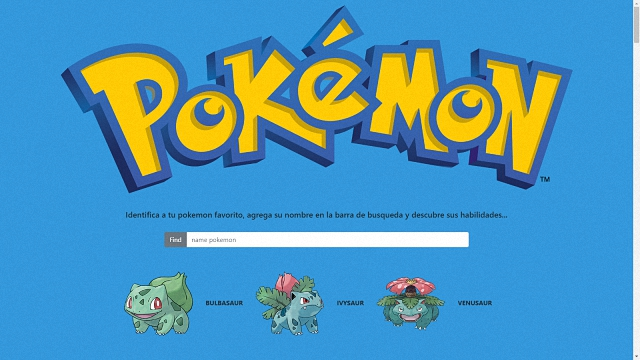
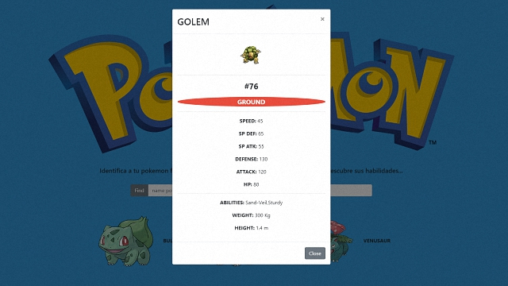

# POKEDEX

¿Alguna vez viste Pokemon? Si no, no importa, ahora te enterarás de que trata. Un pokedex es un buscador de Pokemons, donde puedes obtener información sobre el pokemon que buscas. Usando la API de Pokeapi diseña tu propio pokedex. 

***

***

### RETO

Un pokedex es un buscador de Pokemons, donde puedes obtener información sobre el pokemon que buscas. Usando la API de Pokeapi diseña tu propio pokedex.

***

### HERRAMIENTAS DE TECNOLOGIA APLICADAS

+ HTML 5

+ CSS 3

+ Boostrap 4

+ JQuery 

***

### ELABORADO PARA:

***

### ELABORADO POR:

* Nadya Salazar alias **Navy**